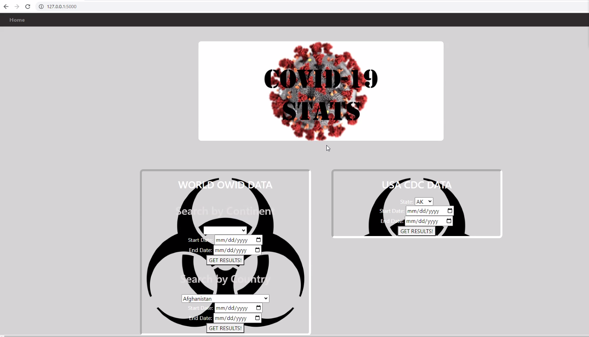
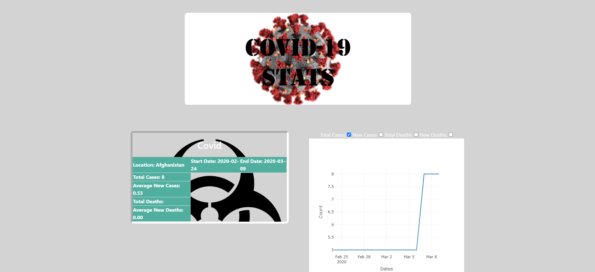

# Covid-19 Data Flask App

## Table of contents

* [Coivd-19 Data](#covid-19-data)
* [Data Sources](#data-sources)
* [Technologies](#technologies)
* [Extract](#extract)
* [Transform](#transform)
* [Load](#load)
* [Visualizations](#visualizations)
* [HTML](#html)
* [Run Flask App](#run-flask)
* [Contacts](#contacts)

## Covid-19 Data

Objective: The objective was to present a more easily searchable Covid-19 data recorded throughout the heights of the pandemic by continent or by country and the date range.

## Data Sources

- [World Data](https://covid19.who.int/data)
- [United States](https://data.cdc.gov/Case-Surveillance/United-States-COVID-19-Cases-and-Deaths-by-State-o/9mfq-cb36)

## Technologies
* Python
* Flask
* Javascript
* HTML/CSS
* Plotly
* Jupyter Notebook
* SQLiteStudio

# Extract

Placeholder

# Transform

Placeholder

# Load

Placeholder
 
# Deploy
 
Placeholder
 
# Visualizations
 
Placeholder

## Run Flask

Placeholder

## Contacts

[Annette Heredia](https://github.com/AnnetteHeredia)

[Emanuel Villa](https://github.com/mannievilla)

[Johnathan Fludd](https://github.com/JohnathanFludd)

[Jordan Alonzo](https://github.com/jalonzoajordan)

[Miguel Martinez](https://github.com/mmtz97)

[Steven De Noia](https://github.com/Stencoss)
